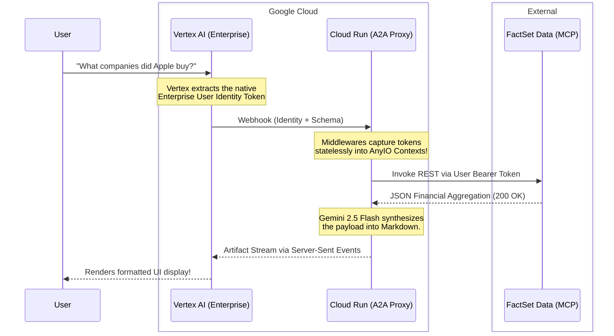

# System Architecture 

**FactSet Agent-to-Agent (A2A) Routing Proxy**

The Gemini Agent Builder natively prefers executing explicit, low-latency REST HTTP handshakes directly against APIs. However, complex quantitative financial executions via the FactSet Market Context Protocol (MCP) frequently run longer than 20 seconds. 

By default, the Vertex UI silently terminates active sockets that do not continuously stream data, resulting in a **Proxy Timeout**.

To mitigate this, we construct a dedicated **Cloud Run A2A Proxy** running the official [Google Agent Development Kit (ADK)](https://github.com/GoogleCloudPlatform/agent-development-kit). This middleware mathematically prevents disconnects by catching the payload and generating continuous keep-alive heartbeats directly back up the payload chain.

---

## 🏗 The Multi-Agent Pipeline

The native `A2aStarletteApplication` framework orchestrates user connections through the following sequential pipeline:

---

## 🔑 Stateless Identity Abstraction

Because Cloud Run containers explicitly load identical `.env` bindings globally for all parallel traffic requests, hardcoding User Authentication logic into the `ADK` engine compiles a fatal vulnerability where User A theoretically commands User B's FactSet connection.

- 🪝 **AuthorizationContextMiddleware**: Fast-fail interceptor that parses incoming Vertex HTTP Webhooks, pulling dynamic Bearer identity tokens out of the header natively.
- 📦 **ContextVar Mutability**: A secure AnyIO memory structure (`sf_token_var`) temporarily holds the token, actively isolating scope per-request across identical thread loops.
- 🔄 **Patched Get Tools**: Prior to resolving a REST execution payload against FactSet, the custom `gemini_agent.py` hook scans the underlying memory block, grabs the isolated User key, and strictly assigns it to the `Authorization` header map exactly once!

---

## 🛑 Tool Hallucination Shielding

When large language models like `Gemini 2.5 Flash` encounter multi-layered nested JSON execution endpoints requiring logical iteration (such as fetching 15 iterations of yearly target data), they inherently default toward **generative code execution plugins**. 

Instead of formatting traditional JSON mapping protocols, the Agent embeds explicit, executable Python logic (e.g., `import datetime, uuid`) into the FactSet Array string inside Vertex! The UI engine violently crashes when attempting to parse non-JSON arrays (`Malformed function call`).

We natively restrict this vulnerability via strict `NO PYTHON` explicit markers engineered strictly into the Agent Persona prompts!
