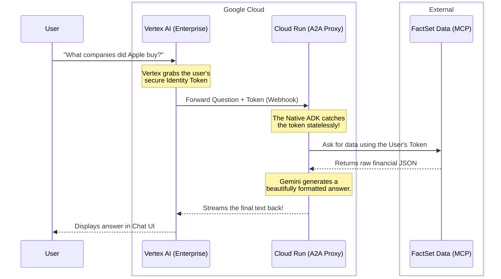

# What is an Agent-to-Agent (A2A) Architecture?

*(Explain it to me like I'm 5)*

Imagine you are playing at a giant playground (this is **Google Vertex AI**). You want a special toy hidden inside a locked vault (this is **FactSet's Data**). However, you aren't big enough to reach the lock, and Vertex AI doesn't know the password to the vault.

So, Vertex AI builds an invisible walkie-talkie and calls a **Special Helper Robot** (this is our **Cloud Run A2A Proxy**). 
1. You hand your "ID Card" (OAuth Token) to Vertex AI. 
2. Vertex AI talks into the walkie-talkie (A2A stream) and says, "Hey Robot, here is the kid's ID card and their question!"
3. The Robot takes your ID card, walks up to the locked FactSet vault, opens it, reads the data, and whispers the answer back over the walkie-talkie so Vertex AI can tell you!

This "walkie-talkie" system is called **Agent-to-Agent (A2A)**.

---

## The A2A Conversation Flow

Here is exactly how the conversation happens under the hood when a user asks a question in the Gemini Enterprise UI:

## Why couldn't we just connect Vertex AI directly?

By default, Vertex AI likes to connect directly to standard APIs. However, if a question takes too long (like mathematically calculating 15 years of M&A acquisitions), the Vertex UI gets bored waiting and silently "hangs up" the phone (this is called a Proxy Timeout). 

By building our own **Cloud Run A2A Proxy** using the official [Google Agent Development Kit (ADK)](https://github.com/GoogleCloudPlatform/agent-development-kit), our helper robot is smart enough to send continuous "keep-alive" heartbeats back up the walkie-talkie line. This prevents Vertex AI from ever hanging up on us, even if FactSet takes 45 seconds to crunch the numbers!

## Technical Implementation (For Developers)

For deep-dive documentation into how the Native `google-adk` Python library parses this token statelessly and how we injected strict `NO PYTHON` instructions to prevent Gemini from hallucinating code, please continue onto the [Deployment Guide](./deployment.md) and [Debugging Guide](./debugging.md).
